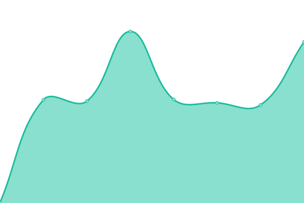
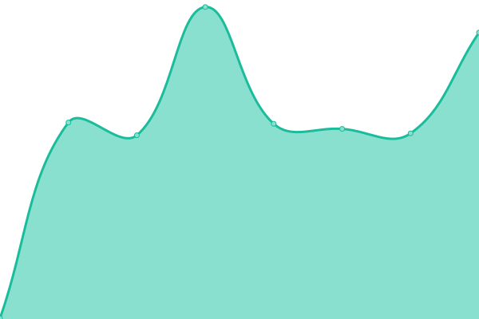
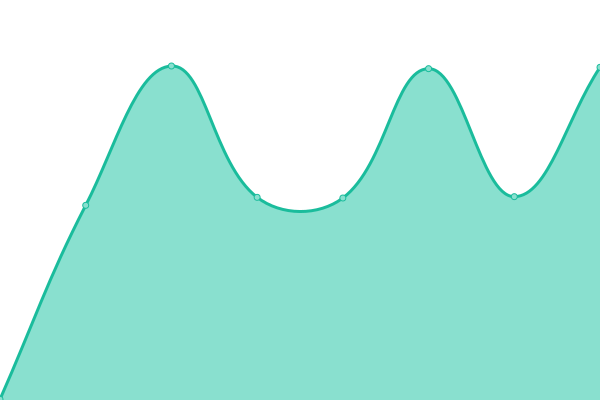

# [📈 Live Status](https://status.artbanx.io): <!--live status--> **🟧 Partial outage**

This repository contains the open-source uptime monitor and status page for [ARTBANX](https://artbanx.io), powered by [Upptime](https://github.com/upptime/upptime).

With [Upptime](https://upptime.js.org), you can get your own unlimited and free uptime monitor and status page, powered entirely by a GitHub repository. We use [Issues](https://github.com/artbanx-monitoring/status-page/issues) as incident reports, [Actions](https://github.com/artbanx-monitoring/status-page/actions) as uptime monitors, and [Pages](https://status.artbanx.io) for the status page.

<!--start: status pages-->
<!-- This summary is generated by Upptime (https://github.com/upptime/upptime) -->
<!-- Do not edit this manually, your changes will be overwritten -->
<!-- prettier-ignore -->
| URL | Status | History | Response Time | Uptime |
| --- | ------ | ------- | ------------- | ------ |
|  [Website](https://artbanx.io) | 🟩 Up | [website.yml](https://github.com/artbanx-monitoring/status-page/commits/HEAD/history/website.yml) | 

 1882ms
     
 | 

<a href="https://status.artbanx.io/history/website">100.00%</a>
    

|  [App](https://app.artbanx.io) | 🟥 Down | [app.yml](https://github.com/artbanx-monitoring/status-page/commits/HEAD/history/app.yml) | 

 0ms
     
 | 

<a href="https://status.artbanx.io/history/app">0.00%</a>
    

|  [User Login](https://app.artbanx.io/auth/rest/public/authentication/password/check) | 🟥 Down | [user-login.yml](https://github.com/artbanx-monitoring/status-page/commits/HEAD/history/user-login.yml) | 

 0ms
     
 | 

<a href="https://status.artbanx.io/history/user-login">0.00%</a>
    

|  [Collections and Permissions API](https://app.artbanx.io/health/front-api/) | 🟥 Down | [collections-and-permissions-api.yml](https://github.com/artbanx-monitoring/status-page/commits/HEAD/history/collections-and-permissions-api.yml) | 

 0ms
     
 | 

<a href="https://status.artbanx.io/history/collections-and-permissions-api">0.00%</a>
    

|  [Art Data API](https://app.artbanx.io/health/art-data-api/) | 🟥 Down | [art-data-api.yml](https://github.com/artbanx-monitoring/status-page/commits/HEAD/history/art-data-api.yml) | 

 0ms
     
 | 

<a href="https://status.artbanx.io/history/art-data-api">0.00%</a>
    

|  [Payments API](https://app.artbanx.io/health/payment/) | 🟥 Down | [payments-api.yml](https://github.com/artbanx-monitoring/status-page/commits/HEAD/history/payments-api.yml) | 

 0ms
     
 | 

<a href="https://status.artbanx.io/history/payments-api">0.00%</a>
    

|  [Identity and Screening API](https://app.artbanx.io/health/kyc/) | 🟥 Down | [identity-and-screening-api.yml](https://github.com/artbanx-monitoring/status-page/commits/HEAD/history/identity-and-screening-api.yml) | 

 0ms
     
 | 

<a href="https://status.artbanx.io/history/identity-and-screening-api">0.00%</a>
    

|  [Shipments API](https://app.artbanx.io/health/shipping/) | 🟥 Down | [shipments-api.yml](https://github.com/artbanx-monitoring/status-page/commits/HEAD/history/shipments-api.yml) | 

 0ms
     
 | 

<a href="https://status.artbanx.io/history/shipments-api">0.00%</a>
    

|  [Service Orchestration](https://app.artbanx.io/health/offering/) | 🟥 Down | [service-orchestration.yml](https://github.com/artbanx-monitoring/status-page/commits/HEAD/history/service-orchestration.yml) | 

 0ms
     
 | 

<a href="https://status.artbanx.io/history/service-orchestration">0.00%</a>
    

|  [Virtual Gallery](https://app.artbanx.io/health/virtual-gallery/) | 🟥 Down | [virtual-gallery.yml](https://github.com/artbanx-monitoring/status-page/commits/HEAD/history/virtual-gallery.yml) | 

 0ms
     
 | 

<a href="https://status.artbanx.io/history/virtual-gallery">0.00%</a>
    

<!--end: status pages-->

[**Visit our status website →**](https://status.artbanx.io)

## 📄 License

- Powered by: [Upptime](https://github.com/upptime/upptime)
- Code: [MIT](./LICENSE) © [ARTBANX](https://artbanx.io)
- Data in the `./history` directory: [Open Database License](https://opendatacommons.org/licenses/odbl/1-0/)
